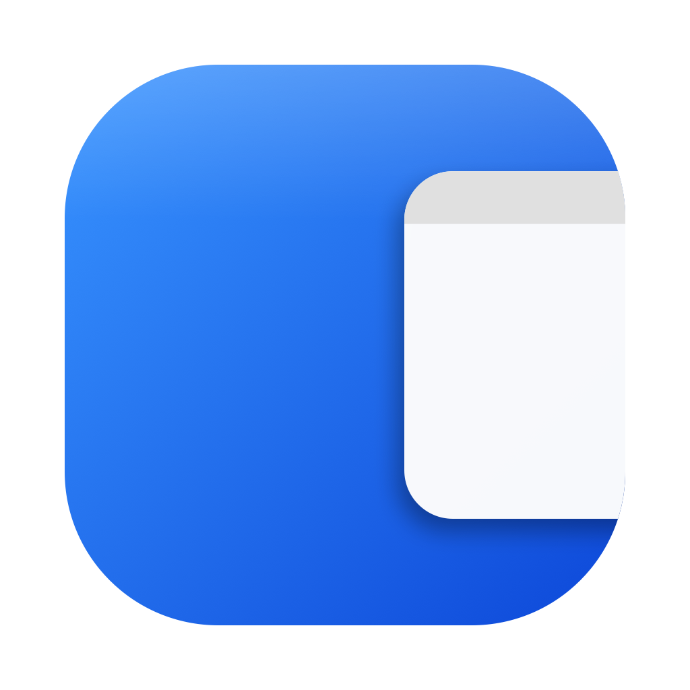

# Findly

**繁體中文** · [English](README.en.md)

從螢幕任一邊滑出一個 Finder 風格的檔案抽屜。選單列、全域快捷鍵召喚，點到其他 app 就自動滑回邊外。

<p align="center">
  
</p>

## 它在做什麼

Findly 是一個 macOS menu bar 小工具。它是一個**自己的視窗**（不是真的 Finder），可以從螢幕四側任一邊滑進/滑出，裡面是一個做得很像 Finder 列表檢視的檔案瀏覽器。

- ⌘\` 召喚／收起；⌃⌥ ↑ / ↓ / ← / → 召喚到上/下/左/右
- 滑鼠在哪個螢幕，就召喚到那個螢幕
- 切換到其他 app → 自動滑出螢幕外；再按一次快捷鍵滑回來
- 拖過內側邊界調整寬高 → 下次召喚記得
- 因為是自己的視窗，靠 `collectionBehavior` 一行就出現在每個 Space，不需要碰 Finder、Apple Events 或私有 SPI

### 抽屜裡是什麼

全新的 **macOS 26「Liquid Glass」外觀**：半透明視窗，把側欄與檔案列表做成兩張圓角內嵌卡片，一條 上一頁/下一頁 + 搜尋 工具列，檔案可拖放進出，並有繁體中文在地化。

- **側邊欄**：一個**原生 SwiftUI 側欄**（用 `List` 搭配 `.listStyle(.sidebar)`，透過 `NSHostingView` 承載），會**鏡像 Finder 的最愛**——它讀取 Finder 的共享檔案清單（需要完整磁碟取用權限）——而且可以**拖曳重新排序**
- **檔案列表**（右側窗格）：仍由 `NSOutlineView` 撐起的 Finder 列表檢視
  - **多欄位**：名稱 / 大小 / 種類 / 修改日期，**點欄位標題就排序**（自然數字排序，`file2` 在 `file10` 前）
  - **Group by Kind**：像 Finder「整理方式 → 種類」那樣的靜態分區標題（資料夾 / 文件 / 影像 / 音訊 …）
  - **進資料夾**：雙擊進入下一層、左上 Back 回上層；資料夾也能用展開三角形就地展開
  - **多選**：拖曳框選 / Shift / ⌘ 點選 / ⌘A 全選
  - **右鍵選單**：開啟 / Quick Look / 在 Finder 中顯示 / 重新命名 / 移到垃圾桶
  - **空白鍵 Quick Look**、Enter 開啟
  - 應用程式合併 `/System/Applications`，symlink（如 Dropbox → CloudStorage）會解析成真實資料夾

## 為什麼是這個樣子

最初的方向是「不要重做檔案瀏覽 UI」——直接用 AppleScript 開一個真的 Finder 視窗，再用 Accessibility API 控制它的位置大小，把真 Finder 當抽屜。

這條路能跑，但要付的代價很大：每個 Space 要自己塞一個 Finder 視窗、跨 Space 移動視窗在 SIP 下做不到、要用私有 SkyLight/CGS SPI、要分辨「我們的」視窗 vs 使用者自己的視窗、auto-park 要靠時間戳記猜意圖……複雜度全壓在「借用別人的視窗」這件事上。

最後換方向：**抽屜用自己的視窗**。視窗是自己的，所以：

- 一行 `collectionBehavior = [.canJoinAllSpaces, .fullScreenAuxiliary, .stationary]` 就出現在每個 Space，沒有 CGS 體操
- 沒有 Apple Events、沒有 Accessibility、沒有私有 SPI、沒有 per-Space 記帳
- 滑入/滑出動畫自己掌控，park 只是把 frame 移到螢幕外

代價是檔案瀏覽 UI 得自己刻——但用 `NSOutlineView`（Finder 列表檢視的底層元件）可以做到很接近，而且換來的是乾淨非常多的架構。

## 安裝

從 [Releases](https://github.com/rocavence/Findly-app/releases/latest) 下載最新的 `Findly-x.y.z.zip`,解壓後把 **Findly.app** 拖進「應用程式」。

Findly 是自簽 app(未經 Apple 公證),第一次打開可能被擋(「Apple 無法驗證…是否含有惡意軟體」)。用以下任一方式放行:
- **右鍵 → 打開**,在對話框再按一次「打開」;或
- 終端機執行 `xattr -dr com.apple.quarantine /Applications/Findly.app`,再打開。

**完整磁碟取用權限**:抽屜要瀏覽整個檔案系統(側欄也會鏡像 Finder 最愛)。到「系統設定 → 隱私權與安全性 → 完整磁碟取用權限」把 Findly 打開。沒授權的話,TCC 保護的資料夾(桌面、文件、下載、CloudStorage/Dropbox …)會列成空的,側欄會退回內建清單。

<details><summary>從原始碼自行 build</summary>

```bash
git clone https://github.com/rocavence/Findly-app.git
cd Findly-app
./Scripts/build-app.sh
open build/Findly.app
```
只需要 Xcode Command Line Tools。
</details>

## 使用

| 動作 | 觸發方式 |
|---|---|
| 召喚／收起 | menu bar icon → Toggle Drawer，或 ⌘\` |
| 召喚到某一邊 | menu bar icon → Snap，或 ⌃⌥ + 方向鍵 |
| 收起 | 切換到其他 app（自動），或快捷鍵再按一次 |
| 排序 | 點欄位標題；或用 Group by Kind 分區 |
| 進資料夾 / 回上層 | 雙擊資料夾 / 左上 Back |
| 對檔案操作 | 右鍵：開啟 / Quick Look / 在 Finder 顯示 / 改名 / 移到垃圾桶 |
| 改寬高 | 拖視窗內側邊界，會記住 |

## 技術棧

- **Swift 6** / **AppKit**（純 system framework，無第三方依賴）
- **`NSPanel`** 自繪抽屜，`collectionBehavior` 跨所有 Space
- **SwiftUI** 側邊欄——用 `List` 搭配 `.listStyle(.sidebar)`，透過 `NSHostingView` 承載——與 AppKit 並用
- **`NSOutlineView`** 撐起檔案列表（view-based，多欄位 + sortable headers + group rows）
- **`UniformTypeIdentifiers`** 依 `UTType` 分類；**Quick Look** 預覽
- **Carbon `RegisterEventHotKey`** 全域快捷鍵（不需新增權限）
- **Swift Package Manager** + shell script 打 `.app` bundle + 穩定自簽 codesign
- **`CGContext` + `sips` + `iconutil`** 程式化生成 icon

## 專案結構

```
Findly-app/
├── Package.swift
├── Sources/Findly/
│   ├── main.swift              # NSApplication entry
│   ├── AppDelegate.swift       # menu bar + 召喚路由（+ debug 視窗模式）
│   ├── DrawerController.swift  # 滑入/滑出、auto-park、拖曳調厚度、動畫
│   ├── DrawerWindow.swift      # 自繪 NSPanel，跨所有 Space
│   ├── FileBrowserView.swift   # Finder 列表檢視（側邊欄 + 多欄位 + 分組 + 右鍵）
│   ├── FullDiskAccess.swift    # 偵測 FDA 並引導
│   ├── HotkeyManager.swift     # Carbon 全域快捷鍵
│   ├── ScreenEdge.swift        # 邊緣 frame 計算
│   └── Defaults.swift          # UserDefaults wrapper
├── Resources/                  # Info.plist / AppIcon.icns / icon-1024.png
├── Scripts/                    # build-app.sh / make-icon.{sh,swift}
└── Tests/FindlyTests/
```

## Debug 旗標

| 環境變數 | 作用 |
|---|---|
| `FINDLY_DEBUG_AUTOSHOW=1` | 啟動後自動滑出抽屜 |
| `FINDLY_DEBUG_NOPARK=1` | 停用 auto-park（測試時把抽屜釘住） |
| `FINDLY_DEBUG_WINDOW=1` | 把瀏覽器放進普通視窗，繞開抽屜/FDA，方便檢視截圖 |
| `FINDLY_DEBUG_PATH=<path>` | 指定 debug 視窗開啟的路徑 |

## 已知限制

- 只在 macOS 14+ 測過，主力測試環境 macOS 26（Tahoe）
- 採穩定自簽身分（仍未經 Apple 公證）；下載的副本會被 Gatekeeper 擋，直到清掉 quarantine 屬性為止（見「安裝」）
- 檔案瀏覽器是 Finder 的「近似」，不是真 Finder——tag、標籤頁、欄位檢視等尚未實作
- 首次啟動若還沒授權 FDA，系統設定視窗會搶走焦點、令自動彈出的抽屜立刻 park

## 這個專案怎麼做出來的

整個專案是用 [Claude Code](https://claude.com/claude-code) 在連續幾段對話裡邊聊邊長出來的——包含上面「驅動真 Finder → 自繪抽屜」那次架構大轉向，以及把瀏覽器從 `NSBrowser` 欄位檢視換成 `NSOutlineView` 列表檢視的反覆迭代。

## 授權

MIT
